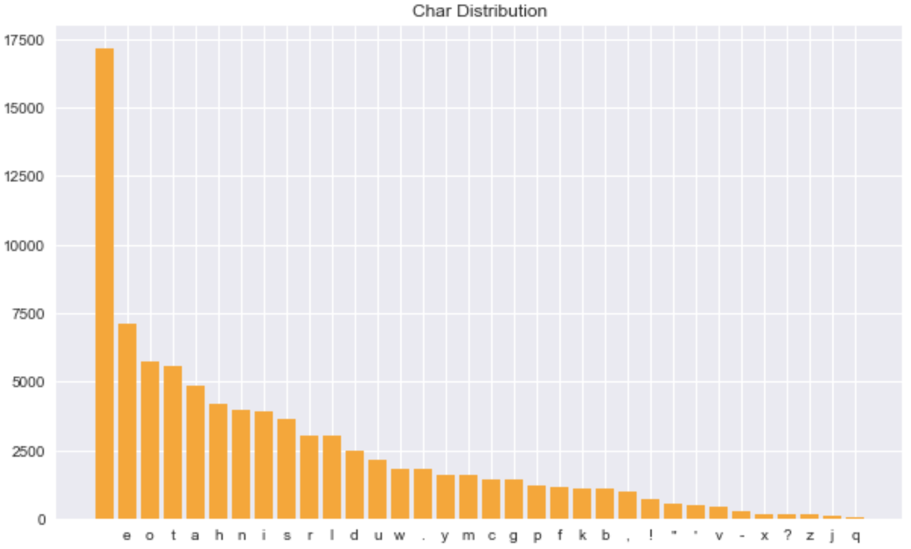
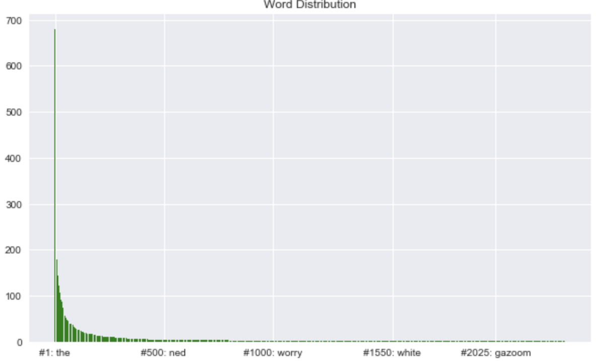

# dr-seuss

Dr. Seuss styled text generation using Long Short-Term Memory Networks.

## Data

### Books
[21 Dr. Seuss Books](https://github.com/briancheang/dr-seuss/tree/master/notebooks/texts/individual)

### Characters
- 84924 total characters
- 34 unique characters

### Words
- 16423 total words
- 2345 unique words

## Results

### Character Level RNN:
i said, "no! no! mo! oh the things io iov not one on there. iow wo saw all you will go tsy some aad stme are fants ao aave fun and some are fall. and they san to us hin bant! and they have coller ao have ao fel and some are fald. and they san to us ain gat. bat let them hele. he should not be here when your mother is not all.... they have all detd and some are fall. and they have come a dight oo yo or a poo. in the haule will wo hat in a tree. you will goll. i will eat them in a house? would you, could you, could you, in the dark? i aainen no coned in the dark. iot in the dark! not in the dark! not on a train! not in the dark. not in the dark? and in the dark? and in the dark? and in the dark? and in the dark? and in the dark? and in the dark. and in the dark. and in the dark. and in the dark. and in the dark. and in the dark. and in the dark, and iew that is not all.... they wet out of the wall with a bookle-doo an a flace in the hatre tney aave to ge pet with a bookle-doo woo moo

## Future Work
